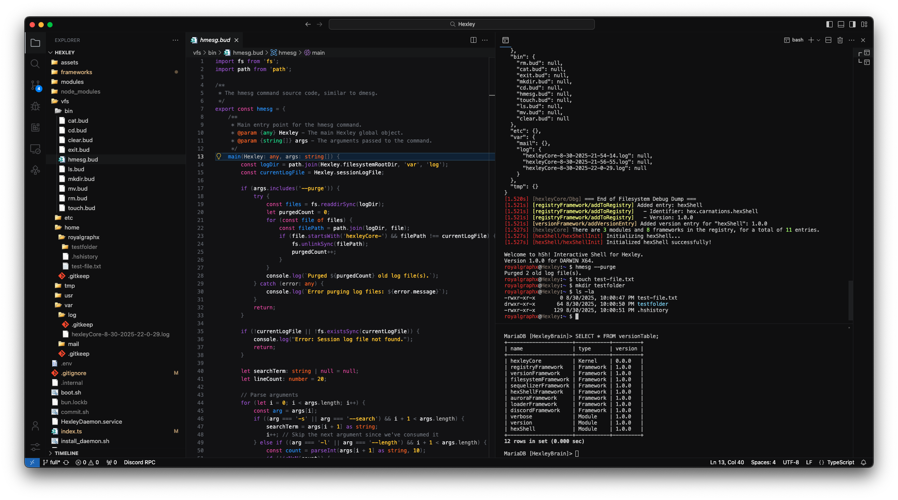

<p align="center">
  
</p>

# Hexley
An Open Source and Modular psuedo Operating System. Badly modeled after XNU and allows using Discord as an interface. Allowing you to create a workspace, and a Discord Bot all in one!

<br>
<p align="center">
  
</p>
<br>

# Features

The goal of Hexley is to provide a sort of playground for Java/TypeScript code, called the Hexley Software Development Kit (HSDK). This will provide you with a Bun environment to create small programs and automations, that can also be accessed in a variety of ways through various "Interfaces". The main way to communicate with the pseudo basic kernel operating system is the Discord Interface, and the internal hexShell Interface. You can create code that allows you to run programs on your system, and output that data in a neat way for hexShell, or more interestingly, Discord.

Allow your users to enjoy the power of your Hexley host hardware by extending the possibilities you can bring for enriching your Discord server experience. You end up allowing all of your users, to use the hardware Hexley is running on, to it's full potential, with limited scopes for security and privacy.

Our users in both DarwinKVM and Carnations Botanica, are able to use popular toolings like ``macserial``, ``macrecovery``, and ``ocvalidate`` at will, by simply issuing slash commands to request Hexley perform an action with provided user data, then neatly representing that in Discord embeds from how the execution went.

Anyone is free to develop and contribute by working on your own modules and frameworks! With the SDK examples provided for the Hexley environment within the ``assets/`` directory, you can create connections for your favorite Interfaces! 

Besides the main points, it's oddly a really nice way to debug and test NodeJS/JavaScript/TypeScript code because imagine you are running an Operating System, that executes that format natively! Your ``.js``/``.ts`` files amazingly become *binary files* (``.bud``) in this environment that you can run through the hexShell.
</br>
</br>

<h3>You are currently viewing <code>Hexley Full</code>, which includes the following:</h3>
</br>

| Name | Type | Purpose | Commands |
| --- | --- | --- | --- |
| Aurora | Framework | Adds the ability to color the console | None |
| Discord Interface | Framework | Allows Hexley to communicate via Discord | None |
| Filesystem (hexFS) | Framework | Provides a Virtual File System for Hexley | None |
| hexShell | Framework | Abstractions for hexShell Module | None |
| Loader | Framework | Allows Hexley to load 3rd Party Frameworks/Modules | None |
| The Registry | Framework | Gives Hexley a registry tree for loaded data | None |
| Sequelizer | Framework | Adds the ability to use a MySQL/MariaDB server for data storage | None |
| Version Global | Framework | Maintains the HGO Versions Object | None |
| hexShell | Module | Provides the interactive shell environment for Hexley. | None |
| verbose | Module | Provides Hexley with the ability to read Guild Messages in Console. | None |
| version | Module | Provides Discord Users a Version command to access version data! | ``/version`` |

Install Bun Runtime using NPM, then install Hexley dependencies and boot with:

```bash
npm install -g bun
bun install
chmod +x boot.sh
./boot.sh
```

Written within a [DarwinKVM](https://github.com/royalgraphx/DarwinKVM) virtual machine!

Join the [Discord Server](https://discord.gg/ryQFC8Vk7b) that Hexley lives in!


