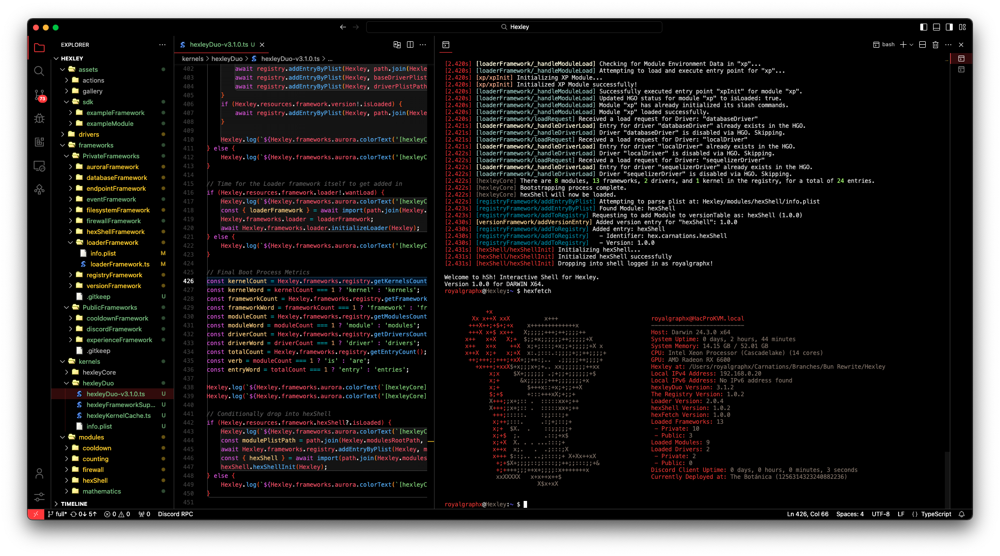

<p align="center">
  
</p>

# Hexley
The Open Source and Modular psuedo "Operating System" by Carnations Botanica. Badly modeled after XNU (Only in naming conventions) and allows using external services as an interface. Allows you to create a workspace, and a bot all in one!

<br>
<p align="center">
  
</p>
<br>

# Overview

The goal of Hexley is to provide a sort of playground for Java/TypeScript code, called the Hexley Software Development Kit (HSDK). This will provide you with a Bun environment to create small programs and automations, that can also be accessed in a variety of ways through various "Interfaces". 

## Interfaces

The main way to communicate with the pseudo operating system is the internal hexShell Interface. You can create code that allows you to run programs on your system, and output that data in a neat way for hexShell, or more interestingly, external services like Discord, Telegram, Slack, GitHub, Twitch, and so on.

## Advantages

Allow your users to enjoy the power of your Hexley host hardware by extending the possibilities you can bring for enriching your community experience. You end up allowing all of your users, to use the hardware Hexley is running on, to it's full potential, with limited scopes for security and privacy in mind.

Our users in both DarwinKVM and The Botanica, are able to use popular toolings like ``macserial``, ``macrecovery``, and ``ocvalidate`` at will, by simply issuing slash commands to request Hexley perform an action with the provided user data, then neatly representing that in Discord as responses, replies, embeds and standard messages of how the execution went, or pretty-print that data for end-users.

Anyone is free to develop and contribute by working on your own modules and frameworks! With the SDK examples provided for the Hexley environment within the ``assets/`` directory, you can create automations, handlers, and connections for your favorite Interfaces!

## hexShell

Besides the main points and standard usage of Hexley as a project, it's oddly a really nice way to debug and test NodeJS/JavaScript/TypeScript code because you are essentially running an Operating System, that executes that format natively! Your ``.js``/``.ts`` files amazingly become pseudo *binary files* (``.bud``) in this environment that you can run through the hexShell. This allows you to call functions from your frameworks or modules, and report, or manipulate that data at will.
</br>
</br>

<h3>You are currently viewing the <code>Hexley Full</code> branch, which includes the following:</h3>
</br>

| Name | Type | Purpose | Commands |
| --- | --- | --- | --- |
| TBD | TBD | TBD | TBD |

</br>
</br>

Install Bun Runtime using NPM, then install Hexley dependencies and boot with:

```bash
npm install -g bun
bun install
chmod +x boot.sh
./boot.sh
```

Written within a [DarwinKVM](https://github.com/royalgraphx/DarwinKVM) virtual machine!

Join the [Discord Server](https://discord.gg/ryQFC8Vk7b) that Hexley lives in!


